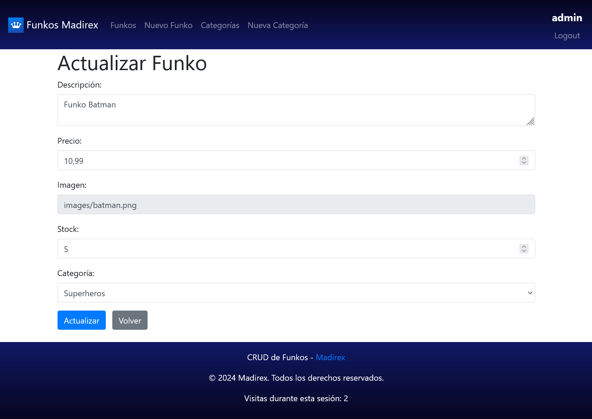

# funkos-php
Aplicación REST de Funkos en PHP. Desplegado en Docker. Base de datos en PostgreSQL.

# Usuario admin (para probar)
    Usuario: admin
    Contraseña: Admin1

# Imágenes

  

  

  

  

  

  

